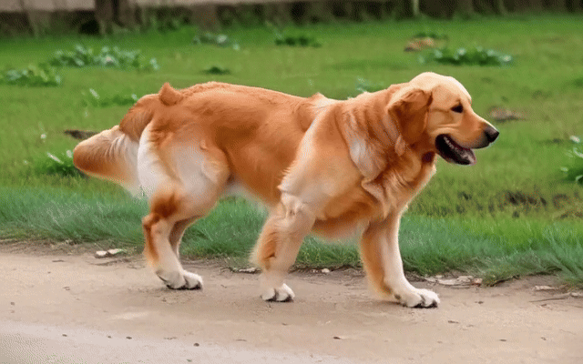
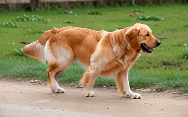
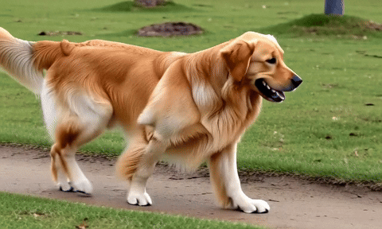
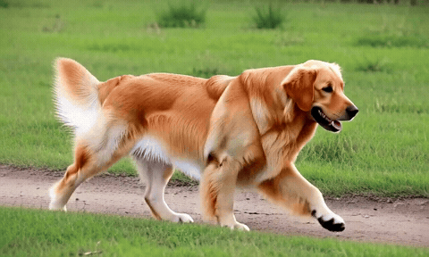
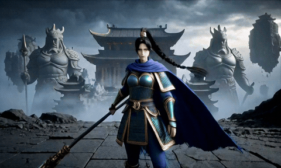

# 7–8 GB VRAM Video Generation

Python/PyTorch video generation with H3 hybrid INT8, Turbo, optional experimental SelfLift-zero and learned 2× enhancement of finished clips. No ComfyUI runtime. The default prompt is one dog walking with a steady camera and simple background. `prompts/lantern.txt` is another simple prompt.

Requires Linux, Python 3.12, a CUDA GPU, `ffmpeg`, [uv](https://docs.astral.sh/uv/getting-started/installation/), around 60 GB disk and preferably 16 GB system RAM. The continuous 15-second dog generation on a Colab T4 peaked at 6.18 GiB sampled GPU memory and 8.72 GiB process RAM. Its 1024×640 enhancement peaked at 5.78 GiB GPU memory and 9.07 GiB process RAM. The T4 has 16 GB VRAM; the allocator cap is 6.5 GiB for short clips and 7.0 GiB for long clips. A physical 8 GB GPU remains untested.

```bash
git clone https://github.com/ujjwal-basnet/7-8gb-vram-video-generation.git
cd 7-8gb-vram-video-generation
uv sync --locked
uv run python download_models.py
uv run python monitor_run.py --frames 39 --output output/scene.mp4
```

Eight-step Turbo at the final resolution:

```bash
uv run python download_models.py --steps 8
uv run python monitor_run.py --mode native --steps 8 --frames 39 --seed 9175 --output output/dog-8step.mp4
```

Eight-step Turbo + SelfLift:

```bash
uv run python download_models.py --steps 8
uv run python monitor_run.py --steps 8 --frames 39 --output output/scene-8step.mp4
```

One continuous 15-second dog video:

```bash
uv run python download_models.py --steps 8
uv run python monitor_run.py --mode native --resolution 512x320 --steps 8 --frames 362 --seed 9175 --output output/dog-15s.mp4
```

Four-step SelfLift is the default. Native mode runs every step at the selected output resolution: 640×384 or 512×320. SelfLift starts at 512×320 and switches to 640×384 after three of four steps or six of eight steps. Both modes export 24-fps video with audio. SelfLift does not guarantee identity, anatomy or motion accuracy. Try 39 frames first; 124 frames gives about five seconds. For more than 124 frames, choose native mode and 512×320. The verified long sample uses 362 frames (15.083 seconds) and eight steps. Edit the prompt or pass `--prompt-file path.txt`.

## Enhance a finished video

```bash
uv run python download_models.py --steps 8
uv run python latent_upscaler.py
uv run python monitor_run.py --script upscale_video.py --input samples/dog-walking-15s.mp4 --output output/dog-hd.mp4
```

This reuses the saved video. The released H3 3D Conv upscaler doubles both dimensions, then H3 performs one low-noise Euler refinement evaluation per overlapping temporal window. The source's eight-step generation is separate. A 512×320 clip becomes 1024×640 at the original 24 fps. Audio is copied from the input, and previously refined overlap is held fixed. The decoder writes chunks directly to FFmpeg to keep memory bounded.

Use your own generated clip with `--input output/dog-15s.mp4 --prompt-file path.txt`. Add `--frames 39` for a short pilot. The command supports H3 inputs with audio, dimensions up to 640×384, and 22–362 frames satisfying `17*n+5`; it retains the original file. The completed 1024×640, 362-frame enhancement took 55m23s on the T4, using 11 refinement evaluations. Generating its eight-step source and enhancing it took about 1h39m in total, excluding downloads. This is an additional quality pass after generation, distinct from the experimental SelfLift transition.

## Optional learned SelfLift transition

```bash
uv run python latent_upscaler.py
uv run python monitor_run.py --steps 8 --frames 39 --upscaler learned3d --output output/learned-8step.mp4
```

This adds the same 3D Conv v1 model (~659 MiB download) inside the SelfLift transition. H3 is unloaded while the upscaler runs; the paired VAE anchor and remaining diffusion steps are retained. Output stays 640×384. Use `--upscaler interpolate` for SelfLift: the learned transition has not been rebenchmarked after correcting its latent scaling. The separately validated enhancement command above applies learned upscaling to a finished clip.

## Notebook

[View the input/output notebook](notebooks/video_generation.ipynb) · [Open in Google Colab](https://colab.research.google.com/github/ujjwal-basnet/7-8gb-vram-video-generation/blob/main/notebooks/video_generation.ipynb)

The notebook shows an editable dog-walking prompt, four/eight-step settings, native/SelfLift modes, resolution, model download, generation, optional enhancement and a video player. Its default input generates a 15-second dog clip and enhances it. Set `ENHANCE=False` for only the base output, or start with `FRAMES=39` for a quicker check. It also displays the preserved samples. Select a GPU runtime on Colab; for local Jupyter, set `PROJECT` to your cloned repository directory.

Each run generates one clip. The 15-second dog was generated in one continuous pass at 512×320 on the capped T4. The existing storm-guardian GIF is a preserved reference from the earlier workflow.

## Generated GIF previews

These loop directly on GitHub. GIF resolution/frame rate is reduced from the original 24-fps videos. GIFs have no audio.

Enhanced continuous dog walking: **1024×640, 24 fps, 362 frames (15.083 seconds)**. Eight-step H3 source → learned 2× upscale → low-noise H3 refinement. Enhancement took 55m23s on the T4, with 5.78 GiB sampled GPU peak and 9.07 GiB process RAM. The original AAC track is byte-identical. Facial detail and fur edges are clearer in the inspected frames; the tail still approaches the frame edge. The GIF is reduced to 640×400 at 8 fps.



[Download the enhanced MP4 with audio](samples/dog-walking-15s-hd.mp4)

Continuous dog walking: eight Turbo steps, native mode, 512×320, 362 frames (15.083 seconds), seed 9175. Generation took 42m48s on the T4; loading and export bring the render to 43m14s. Sampled total GPU memory peaked at 6.18 GiB; process RAM peaked at 8.72 GiB. The tail occasionally reaches the frame edge. SelfLift was disabled for this long sample.



[Download the original MP4 with audio](samples/dog-walking-15s.mp4)

Dog walking: eight Turbo steps, native mode, 39 frames (1.625 seconds), seed 9175. The original video took 14m28s to generate on the T4.



Same dog prompt with eight-step Turbo and interpolation SelfLift: 39 frames, seed 9175, 16m25s generation on the T4. Sampled GPU peak was 4.48 GiB; process RAM peaked at 8.56 GiB. Native was faster for this tested size and memory profile.



The following reference samples used four-step SelfLift:

Short scene:



15-second film:


Upstream models and code: [MiniMax H3](https://huggingface.co/MiniMaxAI/MiniMax-H3), [hybrid checkpoint](https://huggingface.co/smhfacct/Minimax-H3-fl2va-ref2va-hybrid-models), [DiffSynth-Studio](https://github.com/modelscope/DiffSynth-Studio), [NF4 components](https://huggingface.co/DiffSynth-Studio/MiniMax-H3-NF4), [LightX2V Turbo](https://huggingface.co/lightx2v/Minimax-h3-Turbo), [SelfLift research](https://arxiv.org/abs/2609.02036), [comfy-kitchen](https://github.com/Comfy-Org/comfy-kitchen). Their licenses/model terms apply. This is an experimental SelfLift-zero adaptation; no trained SelfLift LoRA or model weights are included.

The optional [H3 latent upscaler weights](https://huggingface.co/LBH-123-AI/Minimax_h3_latent_Upscaler) use Apache-2.0 terms. Its network code is extracted from [LBH-123-AI's implementation](https://github.com/LBH-123-AI/Comfyui_Minimax_h3_latent_Upscaler) under the included [MIT notice](licenses/h3-latent-upscaler-MIT.txt). The bounded inference helper and chunked decoder adapt DiffSynth-Studio's streamed layers, MLP/attention and H3 VAE under the included [Apache-2.0 license](licenses/diffsynth-APACHE-2.0.txt).
